  

## 🎓 Sobre mim

- 🎓 Estudante de Engenharia de Software na **FIAP**
- 💻 Front-end developer intern na **Editora Globo** (Infoglobo / Grupo Globo), no time do **Nodo DS** (design system)
- ⚛️ Construo e migro componentes **React/TypeScript** para a plataforma **Backstage Pages** (Show 1.0 → Show 2.0), usando **Module Federation** e **SSR**
- 🧩 Foco em interfaces performáticas, acessíveis e consistentes dentro de um design system

---

## Skills

  

Componentização, design systems e entrega de interfaces React/TypeScript em produção.

---

## 📨 Contato

  
  
  

